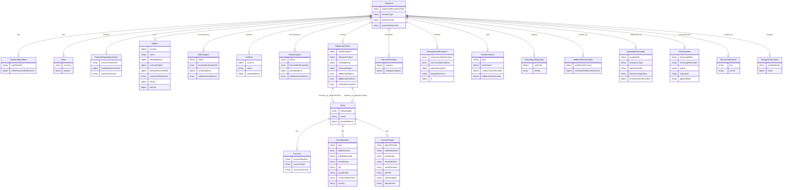

# Payment Instruction Domain Model

```mermaid
erDiagram
    Payment ||--o| PaymentIdentifiers : has
    Payment ||--o| Value : has
    Payment ||--o| PaymentTypeInformation : contains
    Payment ||--o| Debtor : from
    Payment ||--o| DebtorAgent : processed_by
    Payment ||--o| Creditor : towards
    Payment ||--o| CreditorAgent : processed_by
    Payment ||--o| AdditionalParties : involves
    Payment ||--o| PaymentPurpose : describes
    Payment ||--o| RemittanceInformation : includes
    Payment ||--o| TaxInformation : with
    Payment ||--o| RegulatoryReporting : requires
    Payment ||--o| SettlementInformation : settled_via
    Payment ||--o| MandateInformation : authorized_by
    Payment ||--o| FxInformation : converted_with
    Payment ||--o| SecureVerification : verified_by
    Payment ||--o| ChargesInformation : charges

    PaymentIdentifiers {
        string endToEndId
        object otherPaymentReferences
    }

    Value {
        string currency
        string amount
    }

    PaymentTypeInformation {
        string serviceLevelCode
        object localInstrumentCode
        string paymentContext
    }

    Debtor {
        object account
        string name
        object postalAddress
        object contactDetails
        object dateAndPlaceOfBirth
        string countryOfResidence
        object device
        object partyId
    }

    DebtorAgent {
        string name
        array financialInstitutionIds
        object postalAddress
        array additionalInstitutions
    }

    Creditor {
        object account
        string name
        object postalAddress
    }

    CreditorAgent {
        string name
        array financialInstitutionIds
        object postalAddress
        array additionalInstitutions
    }

    AdditionalParties {
        object ultimateDebtor
        object ultimateCreditor
        object initiatingParty
        object instructedAgent
        array additionalDebtors
        array additionalCreditors
        array intermediaryAgents
    }

    Party {
        array individualIds
        string name
        object postalAddress
    }

    PaymentPurpose {
        object purpose
        object categoryPurpose
    }

    RemittanceInformation {
        array unstructuredInformation
        array structuredInformation
        object agentInstructions
        string foreignCurrency
        object fx
    }

    TaxInformation {
        string type
        object taxAmount
        object creditorTaxInformation
        object debtorTaxInformation
    }

    RegulatoryReporting {
        object authority
        array details
    }

    SettlementInformation {
        object settlementAccount
        object interbankSettlementAmount
    }

    MandateInformation {
        string mandateId
        string sequenceType
        string signatureDate
        string electronicSignature
        object amendmentInformation
    }

    FxInformation {
        string exchangeRate
        string exchangeRateType
        string rateId
        string contractId
        string appliedRate
    }

    SecureVerification {
        string key
        string secret
    }

    ChargesInformation {
        string chargeBearer
        object value
    }

    Payment {
        string requestedExecutionDate
        string transferType
        string paymentType
        string paymentExpiresAt
    }

    Party ||--o| Account : has
    Party ||--o| PostalAddress : has
    Party ||--o| ContactDetails : has

    Account {
        string accountNumber
        string accountType
        string accountCurrency
    }

    PostalAddress {
        string type
        array addressLines
        string buildingNumber
        string streetName
        string city
        string postalCode
        string countrySubDivision
        string country
    }

    ContactDetails {
        string phoneNumber
        string mobileNumber
        string faxNumber
        string emailAddress
        string emailPurpose
        string jobTitle
        string responsibility
        string department
    }

    AdditionalParties ||--o| Party : includes_as_ultimateDebtor
    AdditionalParties ||--o| Party : includes_as_ultimateCreditor
```